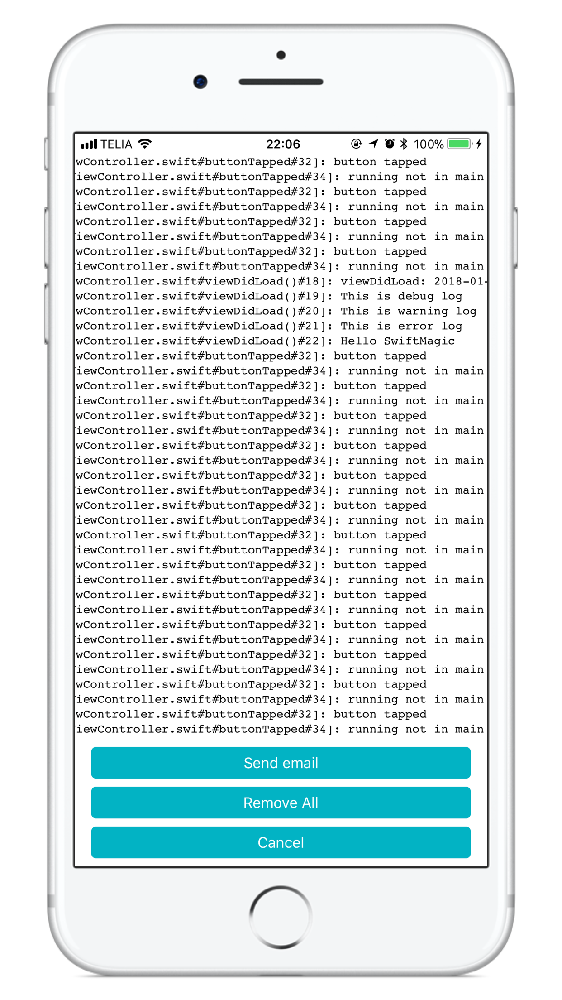

# SwiftyLog

[](http://cocoapods.org/pods/SwiftMagic)
[](http://cocoapods.org/pods/SwiftMagic)
[](http://cocoapods.org/pods/SwiftMagic)

SwiftyLog is a tool to record log in an elegant way. You also can send the log to the specified email address by shaking the device. Easy to use

## 1. Example

To run the example project, clone the repo, run "Example" Target from Xcode.

## 2. Requirements

Xcode: 9.0

iOS: 9.0

## 3. Installation

SwiftyLog is available through [CocoaPods](http://cocoapods.org) or [Carthage](https://github.com/Carthage/Carthage). 

### 3.1 [CocoaPods](https://guides.cocoapods.org/using/using-cocoapods.html)
To install it, simply add the following line to your Podfile:

```ruby
pod 'SwiftyLog'
# or
# pod 'SwiftyLog', :git => 'https://github.com/zhihuitang/SwiftyLog.git'
```

### 3.2 [Carthage](https://github.com/Carthage/Carthage)
Add this to Cartfile

```
github "https://github.com/zhihuitang/SwiftyLog.git"
```

Then run `carthage update` from command line:

```
$ carthage update
```


## 4. Usage

```swift
import SwiftyLog

let logger = Logger.shared

@UIApplicationMain
class AppDelegate: UIResponder, UIApplicationDelegate {

    func application(_ application: UIApplication, didFinishLaunchingWithOptions launchOptions: [UIApplicationLaunchOptionsKey: Any]?) -> Bool {
		
        // Disabled by default
        // Logger.shared.level = .none
        logger.level = .info
        logger.showThread = true
        logger.ouput = .debugerConsoleAndFile
        
        logger.d("Application started")
        // logger.i("information log")
        // logger.e("error log")
        // logger.d("debug log")
        // logger.w("warning log")

        return true
    }

}
```

output:
```
2018-01-13T21:20:46.149Z 💚d-<NSThread: 0x1c0261dc0>{number = 1, name = main}[AppDelegate.swift#application(_:didFinishLaunchingWithOptions:)#26]: Application started
```

### View logs by shaking device:

**Shake** your device to view the logs on your test iPhone. In that page, you also can click button **Send email** to send the log file to specified email inbox:



## 5. Author

Zhihui Tang, crafttang@gmail.com

## 6. License

SwiftyLog is available under the MIT license. See the LICENSE file for more info.


